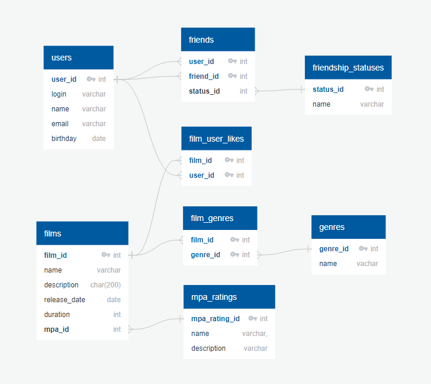

# java-filmorate
### Приложение для друзей, которое позволяет присваивать рейтинг фильмам

#### Схема 


### Краткое описание диаграммы с примерами запросов

+ *Получение всех фильмов*

```
SELECT *
FROM films
ORDER BY name;
```
+ *Получение всех пользователей*
```
SELECT *
FROM users
ORDER BY user_id;
```

+ *Получение 10 самых популярных фильмов*
```
SELECT f.film_id, f.name, COUNT(l.user_id) AS rating
FROM film AS f
INNER JOIN likes AS l ON f.film_id = l.film_id
GROUP BY f.film_id
ORDER BY rating DESC
LIMIT 10;
```
+ *Получение общих друзей с другим пользователем*
```
SELECT frend_id
FROM friends
WHERE user_id = 2
AND friend_id IN (SELECT friend_id
                   FROM friends
                   WHERE user_id = 1);

```